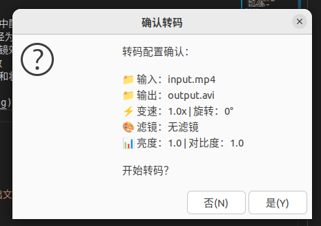

# 基于 FFmpeg 的视频转码器 - 项目架构文档
# 项目概述
```
transcoder-finalwork/
├── CMakeLists.txt                     # 项目构建配置
├── include/                           # 头文件目录
│   ├── audio_decoder.h               # 音频解码器接口
│   ├── audio_encoder.h               # 音频编码器接口  
│   ├── audio_processor.h             # 音频处理器接口
│   ├── demuxer.h                     # 解封装器接口
│   ├── muxer.h                       # 封装器接口
│   ├── queue.h                       # 线程安全队列
│   ├── video_decoder.h               # 视频解码器接口
│   ├── video_encoder.h               # 视频编码器接口
│   └── video_processor.h             # 视频处理器接口
├── src/                              # 源代码实现
│   ├── Transcoder.cpp                # 主程序入口
│   ├── audio_decoder.cpp             # 音频解码实现
│   ├── audio_encoder.cpp             # 音频编码实现 (工厂模式)
│   ├── audio_processor.cpp           # 音频处理实现 (环形缓冲区)
│   ├── demuxer.cpp                   # 解封装实现
│   ├── muxer.cpp                     # 封装实现
│   ├── queue.cpp                     # 队列工具实现
│   ├── video_decoder.cpp             # 视频解码实现
│   ├── video_encoder.cpp             # 视频编码实现
│   └── video_processor.cpp           # 视频处理实现 (OpenGL)
├── thirdparty_ffmpeg/                # FFmpeg 第三方库
│   ├── include/                      # FFmpeg 头文件
│   └── lib/                          # FFmpeg 动态库
└── media/                            # 测试媒体文件
    ├── input.mp4                     # 输入测试视频
    └── output_*.avi                  # 输出结果文件
```
# Day 1
**目标**：搭建基础环境，并实现视频的解封装和解码，验证流程正确性。
## 编译 FFmpeg
- 下载 FFmpeg 4.4 源码
- 通过配置 `./configure` 脚本（启用所需模块，禁用不需要的模块），将其编译成一个独立的动态链接库（.so 文件）
- 将最终产物命名为 `libffmpeg-output.so` 
```bash
huichuan@huichuan-virtual-machine:~/ffmpeg_build/ffmpeg-build/lib$ g++ -shared -o libffmpeg-output.so \
    -Wl,--start-group \
    libavformat.a \
    libavfilter.a \
    libavcodec.a \
    libswscale.a \
    libswresample.a \
    libpostproc.a \
    libavutil.a \
    -Wl,--end-group \
    -Wl,-soname,libffmpeg-output.so \
    -lx264 -lx265 -lvpx -lfdk-aac -lmp3lame -lopus \
    -lva -lva-drm -lva-x11 -lz -lm -lpthread -ldl
```

## 项目构建设置
- 创建项目目录结构
- 编写顶层 `CMakeLists.txt` 文件
- 配置 `CMakeLists.txt` 以找到 FFmpeg 的头文件和我们刚刚编译的 .so 库，并将其链接到我们的可执行文件中

### 实现核心解码逻辑
- 暂用 3 个线程：主线程、视频解码线程、音频解码线程
- **主线程**：负责 Demux 过程，读取视频包并放入两个 `std::queue` 中
- **视频/音频解码线程**：分别从对应的队列中取出数据包，解码成 AVFrame
- **保存结果**：将解码成功的前 10-20 帧视频（YUV 格式）和音频（PCM 格式）分别保存为文件（例如 `output.yuv` 和 `output.pcm`）


###  多线程模型

为了提高效率并为后续完整的转码流程打下基础，我采用了基于“生产者-消费者”模式的多线程架构：

- **一个生产者**：解封装线程（Demuxer Thread），只负责从文件中快速读取数据包，然后将其放入相应的缓冲区，不做耗时的解码工作。
- **两个消费者**：视频解码线程（Video Decoder Thread）和音频解码线程（Audio Decoder Thread），分别从自己的缓冲区中获取数据包并执行解码操作。

### 线程间通信

线程间的数据传递通过自定义的线程安全队列（ThreadSafeQueue）实现：

- 队列基于标准库的 std::queue，并用 std::mutex 对所有访问（push, pop, empty）加锁保护，防止多线程下的数据竞争。
- 为了避免消费者线程在队列为空时空转消耗 CPU，引入了 std::condition_variable。当队列为空时，消费者线程会调用 cond_.wait() 进入休眠状态；当生产者向队列中添加新数据后，会调用 cond_.notify_one() 唤醒一个等待的消费者线程。

###  线程退出机制

为让消费者线程在数据处理完毕后不是无限期阻塞在 pop() 操作上，我设计了一个“哨兵（Sentinel）”机制：

- 解封装线程读取完所有文件数据后，会向视频和音频两个队列中分别推入一个空指针 nullptr。
- 解码线程在循环中 pop() 数据时，一旦发现取出的指针是 nullptr，就视为数据流结束信号，跳出循环，完成线程清理并安全退出。


##  核心实现步骤

###  解封装线程 (demuxer.cpp)

- 打开输入：调用 avformat_open_input() 打开指定媒体文件。
- 分析流信息：调用 avformat_find_stream_info() 读取文件元数据和流信息。
- 查找流索引：遍历 format_context->streams 数组，找到第一个 AVMEDIA_TYPE_VIDEO 和 AVMEDIA_TYPE_AUDIO 类型的流，记录索引号。
- 循环读取：while 循环中反复调用 av_read_frame() 读取 AVPacket。
- 分发数据包：检查 packet->stream_index，如果是视频流则推入视频队列，音频流则推入音频队列。
- 发送结束信号：av_read_frame() 返回 EOF 后，向两个队列分别推入 nullptr。
- 资源清理：关闭输入文件上下文。

###  解码线程（以视频为例，video_decoder.cpp）

- 初始化解码器：根据视频流的编解码器 ID（如 AV_CODEC_ID_H264），用 avcodec_find_decoder() 找到对应解码器，创建并打开 AVCodecContext。
- 循环处理：while 循环中不断处理数据。
- 获取数据包：调用 video_packet_queue->pop() 从队列取 AVPacket（阻塞）。
- 检查结束信号：如果取出的包是 nullptr，跳出循环。
- 解码：用 avcodec_send_packet() 发送 AVPacket，内部循环用 avcodec_receive_frame() 获取 AVFrame。
- 保存结果：每获取一个 AVFrame，就调用辅助函数将 frame 的 YUV 数据写入 output.yuv 文件。只保存前 20 帧。
- 资源清理：释放 AVFrame 和 AVCodecContext。

音频解码线程的逻辑与视频解码线程类似，只是处理的数据类型和保存的文件不同。
###结果
./Transcoder ../media/input1.mp4

## 验证
使用 `ffplay` 命令播放保存的 YUV 和 PCM 文件，以验证解码的正确性：<br/>
**音频：**
ffplay -f s16le -ar 44100 -ac 2 output.pcm

**视频**
<br/>

**查看视频分辨率**
ffprobe -v error -select_streams v:0 -show_entries stream=width,height -of csv=s=x:p=0 ../media/input.mp4
**播放**
ffplay -f rawvideo -video_size 1024x436 -pixel_format yuv420p output.yuv
**片段1**

**片段2**

## 遇到的问题
### 问题一：启动时报告“未找到解码器”
<br/>
解决方法：<br/>
在主线程中，为解码线程创建解码器参数的独立副本。我们使用 avcodec_parameters_alloc() 分配新内存，并用 avcodec_parameters_copy() 复制参数。然后将这个安全的副本传递给子线程，子线程在任务结束后负责调用 avcodec_parameters_free() 将其释放。

### 问题二：播放YUV文件时出现“花屏”或尺寸错误
<br/>
解决方法：<br/>
首先使用 ffprobe 命令精确地检测出原始视频的分辨率和像素格式。然后在C++代码中加入诊断日志，打印出解码器解码第一帧后得到的实际 width, height 和 format。最后，使用这些从程序中得到的、最准确的信息来构建 ffplay 命令，确保播放参数与数据完全一致。
    转移所有权 ： 主线程将指向这个新副本的指针传递给解码线程。

# day2
需要使用4个线程，实现视频转换（视频编码格式为mpeg4格式)，并上传录屏
## 1．编写的队列代码
```cpp
#include "queue.h"
#include <iostream>
extern "C" {
#include <libavcodec/avcodec.h>
#include <libavformat/avformat.h>
}

// 辅助函数：创建并分配AVPacket
AVPacket* create_packet() {
    AVPacket* packet = av_packet_alloc();
    if (!packet) {
        std::cerr << "错误: 无法分配AVPacket" << std::endl;
        return nullptr;
    }
    return packet;
}

// 辅助函数：创建并分配AVFrame
AVFrame* create_frame() {
    AVFrame* frame = av_frame_alloc();
    if (!frame) {
        std::cerr << "错误: 无法分配AVFrame" << std::endl;
        return nullptr;
    }
    return frame;
}

// 辅助函数：安全释放AVPacket
void safe_free_packet(AVPacket** packet) {
    if (packet && *packet) {
        av_packet_free(packet);
        *packet = nullptr;
    }
}

// 辅助函数：安全释放AVFrame
void safe_free_frame(AVFrame** frame) {
    if (frame && *frame) {
        av_frame_free(frame);
        *frame = nullptr;
    }
}

```
## 2.播放转码后视频数据，可以正常看到画面，无花屏等情况
```bash

./EnhancedTranscoder ../media/input.mp4 output_fixed_test.avi 500 2>&1 | tail -10
#必须要最大帧数设置在100帧以上，要不然原视频的黑色开场无法跳过
ffplay output_fixed_test.avi  # 播放视频部分 
```
### 结果 noOpenGL.gif


## 3.使用opengl实现视频旋转功能，并使用ffplay验证正确性(支持多种图像变换 (缩放、翻转、滤镜))
```bash
./build/EnhancedTranscoder media/input.mp4 output_test.avi 100  # 处理100帧
./build/EnhancedTranscoder media/input.mp4 output_test.avi
```
多个功能实现，参数列表如下，见video_processor.cpp
```cpp
// 视频处理参数结构
struct VideoProcessParams {
    // 旋转参数
    float rotation_angle = 0.0f;  // 旋转角度（度），0表示不旋转
    
    // 滤镜参数
    bool enable_blur = false;      // 是否启用模糊滤镜
    bool enable_sharpen = false;   // 是否启用锐化滤镜
    bool enable_grayscale = false; // 是否启用灰度滤镜
    float brightness = 1.0f;       // 亮度调整 (0.0-2.0, 1.0为原始)
    float contrast = 1.0f;         // 对比度调整 (0.0-2.0, 1.0为原始)
    
    // 输出尺寸
    int output_width = 0;     // 输出宽度，0表示使用输入宽度
    int output_height = 0;    // 输出高度，0表示使用输入高度
};

```
滤镜测试脚本见    transcoder-finalwork/build/test.sh
生成的测试样本见    transcoder-finalwork/media/filter_tests
### 旋转效果截图

实现了45度旋转效果<br/>

实现了90度旋转效果<br/>


## 遇到的问题
### 问题： 视频处理模块（如OpenGL）生成的帧尺寸与后续编码器期望接收的帧尺寸不一致，导致编码失败。

    解决思路： 在程序初始化时集中统一计算最终输出尺寸，并用该尺寸去配置所有相关模块（处理器、渲染器、编码器）。

### 问题： 渲染到非正方形目标（FBO）时未校正宽高比，导致旋转后的视频画面被严重拉伸变形。

    解决思路： 在应用旋转变换前，先根据输入视频的宽高比对模型（Model）进行缩放，以抵消视口（Viewport）拉伸带来的失真。


# Day 3 - 音频编码工厂模式与完整音频处理管道
需要使用6个线程，实现音频转换（音频编码格式为ac3格式），并上传录屏1.编写的环形缓冲区2.播放转码后的视频及音频文件，可以正常听到声音3.转码后的音频和视频需要是同步的，不能出现音画不同步4.实现转换后视频0.5倍速，1倍，2倍，3倍的倍速功能，注意需要保证音频变速的同时不变调（可查阅音频变速不变调的原理手动实现或使用第三方库）

## 项目目标（录屏见该文件夹下的结果录屏，分别为旋转和不旋转加减速）
需要使用6个线程，实现音频转换（音频编码格式为ac3格式），并上传录屏
### 1.编写的环形缓冲区(函数实现见audiop_rocessor.cpp)
```cpp
// AudioRingBuffer实现，函数实现见audiop_rocessor.cpp
AudioRingBuffer::AudioRingBuffer(int frame_size, int channels, int sample_rate): frame_size_(frame_size), channels_(channels), sample_rate_(sample_rate), write_pos_(0), read_pos_(0), available_(0) 
{
    // 缓冲区大小为frame_size的4倍，确保有足够空间
    int buffer_size = frame_size_ * channels_ * 4;
    buffer_.resize(buffer_size, 0.0f);
}

```
###  2.播放转码后的视频及音频文件，可以正常听到声音(234结果见录屏与media的输出文件)
### 3.转码后的音频和视频需要是同步的，不能出现音画不同步
### 4.实现转换后视频0.5倍速，1倍，2倍，3倍的倍速功能，注意需要保证音频变速的同时不变调(音频通过 **SoundTouch** 处理数据)

### 扩展功能：实现了简单ui界面用于验证：



## 运行结果与验证（优化后有新增参数，需要添加）
### 1/2倍变速

```bash
huichuan@huichuan-virtual-machine:~/Desktop/xiaomi/transcoder_finalwork/transcoder-finalwork/build$ ./EnhancedTranscoder ../media/input.mp4 output_0.5x.avi  0.5
开始增强转码流程（音视频处理）
输入文件: ../media/input.mp4
输出文件: output_0.5x.avi
变速倍数: 0.5x
流信息获取成功:
  视频: 1024x436 @ 24fps
  音频: 44100Hz, 2 声道
视频信息: 1024x436 @ 24fps
音频信息: 44100Hz, 2 声道
解封装线程已启动，文件: ../media/input.mp4
视频解码线程（输出到Frame队列）已启动。
所有线程已启动，等待完成...
音频解码线程（输出到Frame队列）已启动。
视频编码线程已启动，使用编码器: mpeg4
音频处理线程已启动
视频处理线程启动
音视频合并输出: output_0.5x.avi (AVI格式，包含AC3音轨)
变速倍数: 0.5x (音视频同步)
音频编码线程（工厂模式）已启动
AC3编码器初始化成功: 44100Hz, 2通道, 128000bps, 帧大小: 1536
使用编码器: AC3 Encoder
Mux线程已启动，输出文件: output_0.5x.avi 格式: avi
创建视频流: 1024x436 编码器: mpeg4
创建音频流: 44100Hz, 2 声道, 编码器: ac3
音频变速处理器初始化成功，速度倍数: 0.5
音频变速处理器初始化成功，速度倍数: 0.5
视频流索引: 0
音频流索引: 1
解封装完成，处理了 1147 个视频帧，1941 个音频帧
音频处理器初始化成功，滤波器: [in]anull[out]
音频解码线程（输出到Frame队列）已结束。共解码 1940 帧。
OpenGL版本: 4.3 (Core Profile) Mesa 23.2.1-1ubuntu3.1~22.04.3
GLSL版本: 4.30
OpenGL上下文初始化成功
视频变速处理已启用，速度倍数: 0.5，目标帧间隔: 0.0833333秒
视频处理器初始化成功: 1024x436 -> 1024x436, 旋转角度: 90度
刷新音频处理器...
音频处理线程结束，处理了 1940 帧
刷新音频编码器 (AC3 Encoder)...
音频编码线程（工厂模式）结束，使用 AC3 Encoder 编码了 2587 个包
视频解码线程（输出到Frame队列）已结束。共解码 1145 帧。
视频处理线程结束, 处理了 2272 帧
刷新视频编码器...
视频编码线程结束，编码了 2272 个包
Mux线程已结束，输出文件已生成: output_0.5x.avi
写入了 2272 个视频包和 2587 个音频包
free(): invalid pointer
已中止 (核心已转储)
huichuan@huichuan-virtual-machine:~/Desktop/xiaomi/transcoder_finalwork/transcoder-finalwork/build$ ffprobe -v quiet -print_format json -show_streams output_0.5x.avi | grep -E '"duration"|"nb_frames"'
            "duration": "94.666667",
            "nb_frames": "2272",
            "duration": "90.174694",
            "nb_frames": "2589",
```
### 两倍变速（运行结果上同）
```bash
ffprobe -v quiet -print_format json -show_streams output_2x.avi | grep -E '"duration"|"nb_frames"'
            "duration": "23.875000",
            "nb_frames": "573",
            "duration": "22.604626",
            "nb_frames": "649",
```
### 三倍变速
```bash
ffprobe -v quiet -print_format json -show_streams output_3x.avi | grep -E '"duration"|"nb_frames"'
            "duration": "16.458333",
            "nb_frames": "395",
            "duration": "15.116190",
            "nb_frames": "434",
```


**可以发现，音频流与视频流的帧数基本相同，实现了音画同步**
## 遇到的问题
### 问题： glReadPixels紧密写入的数据与AVFrame带有填充（Padding）的linesize不匹配，导致颜色转换时数据错乱，出现涂抹条纹。

    解决思路： 先将像素读入一个临时的紧密缓冲区，再逐行拷贝到AVFrame中以遵循其linesize。

### 问题： AC3等编码器要求固定大小的音频输入帧，但解码器输出的PCM帧大小却是可变的。

    解决思路： 使用AVAudioFifo作为缓冲池，拼接解码后的PCM数据，再从中取出固定大小的数据块送入编码器。

### 问题： 变速处理时仅修改了时间戳而未正确处理音视频数据本身，导致时长不匹配和DTS非单调递增错误。

    解决思路： 视频通过丢帧、音频通过 **SoundTouch** 处理数据，并为两个流独立地从零开始重新生成线性时间戳。