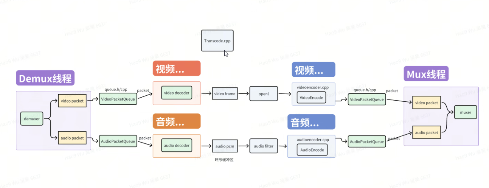
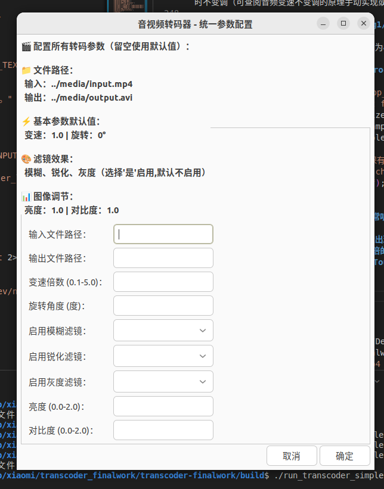
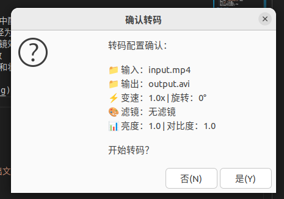
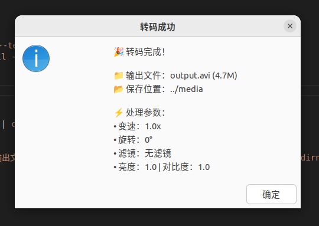

# 高性能音视频转码器
*基于 FFmpeg 和 OpenGL 的多线程音视频转码与处理系统*

*更多详细实现说明请参考 [AAA_Readme](AAA_Readme/README.md)*
## 项目简介

本项目是一个高性能的音视频转码器，支持实时视频处理、音频变速不变调、多种视觉效果以及音画同步。采用多线程架构设计，充分利用 CPU 多核性能，实现高效的音视频处理流水线。
## 项目要求主要功能（✅全部实现）

- ✅ **多格式支持**: 支持常见音视频格式的转码 (MP4, AVI, H.264, MPEG4, AC3)
- ✅ **视频处理**: 基于 OpenGL 的实时视频旋转、缩放、滤镜效果
- ✅ **音频处理**: 变速不变调技术，支持 0.1x - 5x 倍速调节
- ✅ **音画同步**: 精确的时间戳管理，确保音视频同步
- ✅ **多线程架构**: 6线程并行处理，提升转码效率
- ✅ **内存优化**: 线程安全队列和环形缓冲区设计
## 扩展功能
- ✅ **音频编码器工厂**: 支持多种音频编码格式 (AC3, AAC, MP3)，基于工厂模式设计
- ✅ **视频处理增强**: 基于 OpenGL 的实时视频任意角度旋转、缩放、多种滤镜效果
- ✅ **滤镜系统**: 模糊、锐化、灰度转换、亮度/对比度调节
- ✅ **GUI界面**: 通过Zenity实现简洁的图形界面，支持参数预填充，提高测试效率
## 技术栈与架构

**主要技术栈:**
- FFmpeg 6.x - 音视频编解码
- OpenGL 4.3 - GPU 加速视频处理  
- SoundTouch - 音频变速不变调
- C++14 - 核心开发语言
- CMake - 构建系统
- GLFW - OpenGL 窗口管理

**项目架构:**

```
transcoder-finalwork/
├── CMakeLists.txt                     # 项目构建配置
├── include/                           # 头文件目录
│   ├── audio_decoder.h               # 音频解码器接口
│   ├── audio_encoder.h               # 音频编码器接口  
│   ├── audio_processor.h             # 音频处理器接口
│   ├── demuxer.h                     # 解封装器接口
│   ├── muxer.h                       # 封装器接口
│   ├── queue.h                       # 线程安全队列
│   ├── video_decoder.h               # 视频解码器接口
│   ├── video_encoder.h               # 视频编码器接口
│   └── video_processor.h             # 视频处理器接口
├── src/                              # 源代码实现
│   ├── Transcoder.cpp                # 主程序入口
│   ├── audio_decoder.cpp             # 音频解码实现
│   ├── audio_encoder.cpp             # 音频编码实现 (工厂模式)
│   ├── audio_processor.cpp           # 音频处理实现 (环形缓冲区)
│   ├── demuxer.cpp                   # 解封装实现
│   ├── muxer.cpp                     # 封装实现
│   ├── queue.cpp                     # 队列工具实现
│   ├── video_decoder.cpp             # 视频解码实现
│   ├── video_encoder.cpp             # 视频编码实现
│   └── video_processor.cpp           # 视频处理实现 (OpenGL)
├── thirdparty_ffmpeg/                # FFmpeg 第三方库
│   ├── include/                      # FFmpeg 头文件
│   └── lib/                          # FFmpeg 动态库
└── media/                            # 测试媒体文件
    ├── input.mp4                     # 输入测试视频
    └── output_*.avi                  # 输出结果文件

项目采用生产者-消费者模式的6线程并行处理架构：

输入文件 → [解封装线程] → 音视频包队列
                           ↓
[音频解码线程] ← 音频包队列    视频包队列 → [视频解码线程]
      ↓                            ↓
[音频处理线程] ← 音频帧队列    视频帧队列 → [视频处理线程]
      ↓                            ↓
[音频编码线程] ← 处理后帧队列  处理后帧队列 → [视频编码线程]
      ↓                            ↓
      编码包队列 → [封装线程] ← 编码包队列
                     ↓
                  输出文件
```

## 快速开始

### 依赖环境
- **构建工具**: CMake 3.10+
- **必需库**:
  - FFmpeg 6.x (libavformat, libavcodec, libavutil, libavfilter, libswscale, libswresample)
  - OpenGL 4.3+
  - GLFW 3.x
  - SoundTouch
  - pkg-config


## 使用方法

### 1. GUI界面方式（推荐）

为了方便使用，我们提供了基于Zenity的图形界面：

```bash
cd build
./run_transcoder_simple.sh
```

GUI界面特点：
- 🎯 **一站式配置**: 所有参数在单个界面中配置
- 📁 **默认路径**: 自动预设输入/输出路径为media目录
- 🎨 **可视化滤镜选择**: 下拉菜单选择滤镜效果
- ⚡ **实时预览**: 显示当前配置的转码参数
- 📊 **进度显示**: 转码过程中显示进度条和状态



**默认参数示例**

**结果通知**

### 2. 命令行方式

#### 命令格式
```bash
./EnhancedTranscoder <输入文件> <输出文件> [变速倍数] [旋转角度] [模糊] [锐化] [灰度] [亮度] [对比度]
```

#### 完整参数说明

| 参数 | 类型 | 说明 | 默认值 | 示例 |
|------|------|------|--------|------|
| 输入文件 | string | 源视频文件路径 | 必填 | input.mp4 |
| 输出文件 | string | 目标视频文件路径 | 必填 | output.avi |
| 变速倍数 | float | 播放速度倍数 (0.1-5.0) | 1.0 | 1.5 |
| 旋转角度 | float | 视频旋转角度 (度) | 0.0 | 90 |
| 模糊滤镜 | int | 启用模糊效果 (0=关闭, 1=开启) | 0 | 1 |
| 锐化滤镜 | int | 启用锐化效果 (0=关闭, 1=开启) | 1 | 1 |
| 灰度滤镜 | int | 启用灰度转换 (0=关闭, 1=开启) | 0 | 0 |
| 亮度调节 | float | 亮度倍数 (0.0-2.0) | 1.1 | 1.2 |
| 对比度调节 | float | 对比度倍数 (0.0-2.0) | 1.2 | 1.3 |
### 3. 使用示例

#### GUI方式示例
1. **启动界面**：
   ```bash
   cd build
   ./run_transcoder_simple.sh
   ```

2. **配置参数**：
   - 输入路径：`../media/input.mp4` (默认)
   - 输出路径：`../media/output.avi` (默认)
   - 变速：`1.5` (1.5倍速)
   - 旋转：`90` (顺时针90度)
   - 滤镜：启用锐化，关闭模糊和灰度
   - 调节：亮度1.2，对比度1.3

#### 命令行方式示例

**1. 基础转码**
```bash
./EnhancedTranscoder input.mp4 output.avi
```

**2. 变速处理**
```bash
# 2倍速转码
./EnhancedTranscoder input.mp4 output_2x.avi 2.0

# 0.5倍速转码  
./EnhancedTranscoder input.mp4 output_0.5x.avi 0.5
```

**3. 视频旋转与滤镜**
```bash
# 90度旋转 + 锐化滤镜
./EnhancedTranscoder input.mp4 output_rotated.avi 1.0 90 0 1 0

# 45度旋转 + 1.5倍速 + 模糊效果
./EnhancedTranscoder input.mp4 output_complex.avi 1.5 45 1 0 0
```

**4. 完整滤镜配置**
```bash
# 全部滤镜 + 图像调节
./EnhancedTranscoder input.mp4 output_enhanced.avi 1.0 0 1 1 1 1.3 1.4
#                                                      ↑ ↑ ↑ ↑   ↑   ↑
#                                                      模糊 锐化 灰度 亮度 对比度
```

**5. 灰度效果处理**
```bash
# 灰度转换 + 增强对比度
./EnhancedTranscoder input.mp4 output_grayscale.avi 1.0 0 0 0 1 1.0 1.5
```

### 4. 播放验证**
```bash
# 播放转码结果
ffplay output.avi

# 检查文件信息
ffprobe -v quiet -print_format json -show_streams output.avi

# 查看文件大小
ls -lh output*.avi
```

### 5. 滤镜效果说明

| 滤镜类型 | 效果描述 | 适用场景 |
|----------|----------|----------|
| **模糊滤镜** | 柔化画面，减少噪点 | 降噪处理、艺术效果 |
| **锐化滤镜** | 增强边缘细节 | 提升画面清晰度 |
| **灰度转换** | 彩色转黑白 | 艺术效果、减少文件大小 |
| **亮度调节** | 整体明暗调节 | 曝光补偿 |
| **对比度调节** | 明暗对比增强 | 提升视觉冲击力 |